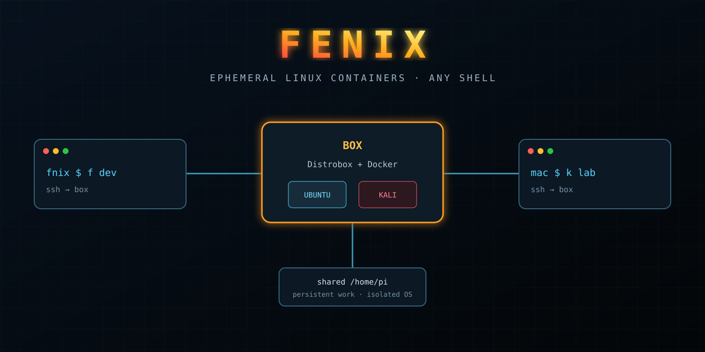
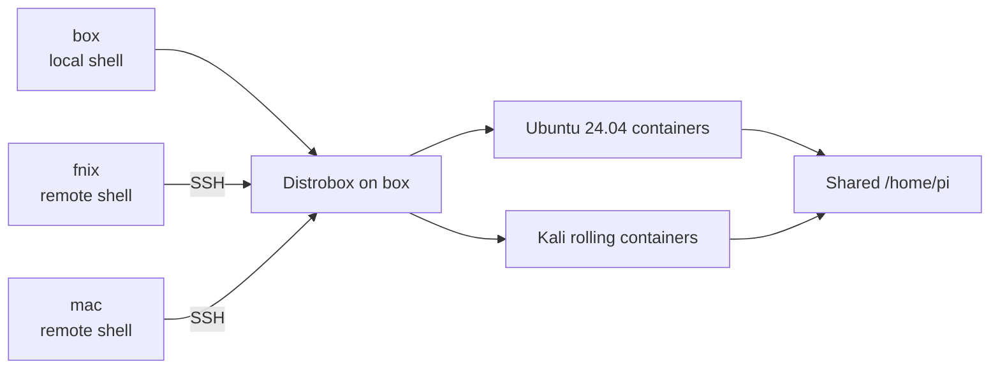
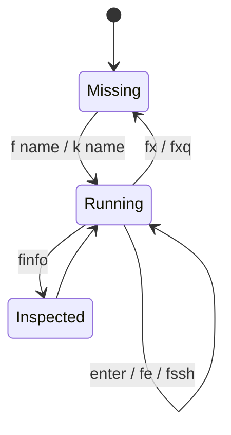
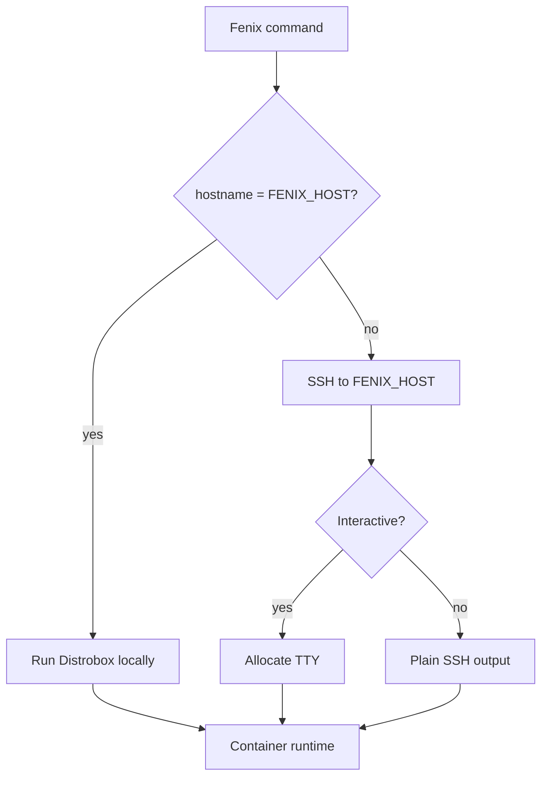
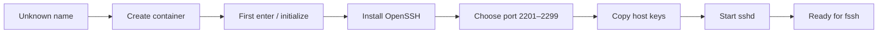

<p align="center"></p>

<h1 align="center">Fenix</h1>

<p align="center"><strong>Ephemeral Linux containers from any shell.</strong><br>One Bash control plane for local work, remote execution, clean experiments, and disposable security labs.</p>

## Why Fenix exists

Fenix turns Distrobox containers on one Linux host into short shell commands available on that host or over SSH from other machines. The operating system is disposable; the work under `/home/pi` remains shared and persistent.



Use it when a task needs package isolation, a clean environment, reproducible experiments, or Kali tooling. Ordinary editing, Git, and host-safe commands do not need a container.

## Command surface

| Command | Mode | Result |
| --- | --- | --- |
| `f` / `fl` | Human / automation | List containers with status colors |
| `f <name>` | Interactive | Create or enter an Ubuntu 24.04 container |
| `k <name>` | Interactive | Create or enter a Kali container |
| `fe <name> <command…>` | Non-interactive | Execute a command in an existing container |
| `fssh <name>` | Interactive | SSH directly into a container through its assigned port |
| `finfo <name>` | Non-interactive | Show status, image, start date, network, and SSH port |
| `fx <name>` | Interactive | Destroy a container after confirmation |
| `fxq <name>` | Non-interactive | Destroy an existing container without confirmation |



Tab completion discovers existing container names for every command that accepts one.

## Execution path

The sourced script compares the current hostname with `FENIX_HOST`. On the designated host it invokes Distrobox directly; everywhere else it forwards the same operation over SSH. Read-only/parsing operations omit TTY allocation, while interactive entry requests one.



Remote connections fail fast after five seconds. `FENIX_HOST` is configurable and defaults to `box`; the Distrobox path and timeout are internal constants in the current script.

## New-container bootstrap

On first creation, Fenix pulls the selected image, mounts a no-password marker, initializes the Distrobox, installs OpenSSH, selects the first free port from `2201–2299`, copies host SSH keys, and starts `sshd`.



### Trust and isolation boundary

- `/home/pi` is shared with containers, so files there are **not isolated** from container processes.
- Containers use host networking; services and ports share the host's network namespace.
- Container SSH daemons reuse the host's RSA, ECDSA, and ED25519 host keys. This avoids changing fingerprints but means they intentionally share one SSH identity.
- Bootstrap installs packages and copies private host keys with elevated privileges. Review `fenix.bashrc` before sourcing it on a new host.
- Destruction removes the container OS. Work in the shared home survives; files elsewhere in the container do not.

## Install

Requirements on the Linux host:

- Bash;
- Docker or Podman;
- Distrobox at `/home/pi/.local/bin/distrobox`;
- passwordless SSH aliases for remote clients, if used.

```bash
git clone https://github.com/nixfred/fenix.git ~/Projects/fenix
mkdir -p ~/.config/fenix
cp ~/Projects/fenix/fenix.bashrc ~/.config/fenix/
printf '\nsource ~/.config/fenix/fenix.bashrc\n' >> ~/.bashrc
source ~/.bashrc
```

On remote machines, copy `fenix.bashrc` into the same config path, source it, and set `FENIX_HOST` if the container host is not named `box`:

```bash
export FENIX_HOST=my-container-host
source ~/.config/fenix/fenix.bashrc
```

## Typical workflows

Interactive Ubuntu environment:

```bash
f dev
# work inside the container
exit
finfo dev
```

Non-interactive automation against an existing container:

```bash
fe dev cat /etc/os-release
fe dev "cd /home/pi/Projects && make test"
```

Disposable Kali environment:

```bash
k lab
# authorized security work only
exit
fx lab
```

Automation should use `fl`, `fe`, `finfo`, and `fxq`; creation and confirmed destruction are interactive. See [HOWTO.md](HOWTO.md) for the assistant-oriented workflow.

## Repository map

```text
.
├── fenix.bashrc             # Sourced command implementation
├── HOWTO.md                 # Non-interactive / assistant usage
├── CLAUDE.md                # Architecture and maintainer context
├── assets/readme-hero.svg   # README title artwork
└── README.md
```

## Verification

The script has no build step. Check syntax before sourcing changes:

```bash
bash -n fenix.bashrc
```

For behavioral testing, use a disposable host or container setup with Distrobox and Docker available; the functions intentionally perform real container, SSH, package-install, and deletion operations.

---

<p align="center"><strong>Persistent work. Disposable systems. One-letter distance.</strong></p>
